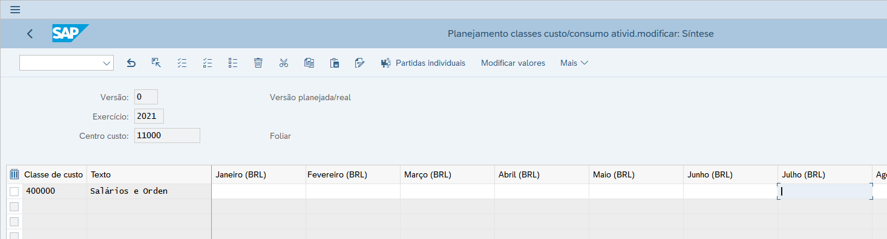
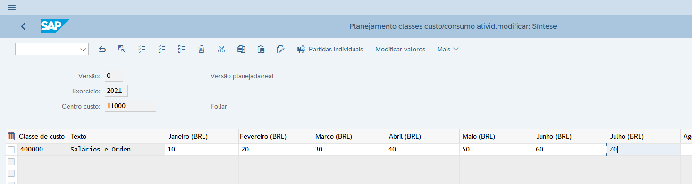

# Bapi/Função que executa a KP06
Classe para executar a transação KP06

Obs: No método constructor é chamada a trasação KP04 para informar o perfil de planejamento. Isso é necessário caso não esteja configurado o perfil default corretamente.
Dependendo do perfil a transação KP06 exibe um layout diferente.

## Exemplo de uso

KP06 antes da execução do método SET_KP06

KP06 após execução do método SET_KP06

## Exemplo de utilização

Na criação do objeto passar os dados de cabeçalho da KP06:
- VERSAO
- EXERCICIO
- CENTRO_CUSTO
- CLASSE_CUSTO

Passar também uma tabela com os dados por período:
- MES
- MONTANTE

